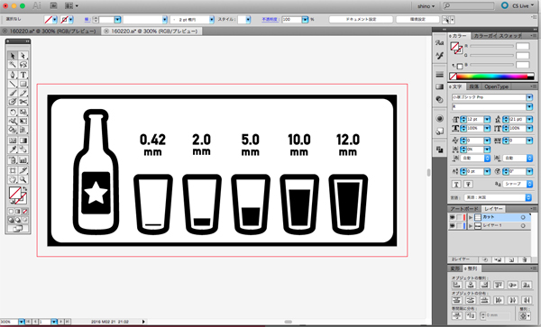
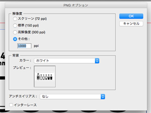
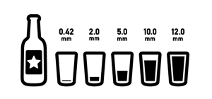
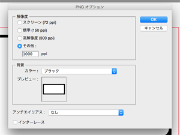

# 01.データ設定
  

## ★データ作成に使用するソフトウェアの例
 

**2Dデータ**

* **Adobe Illustrator（有料）：** [http://www.adobe.com/jp/products/illustrator.html](http://www.adobe.com/jp/products/illustrator.html)
* **Inkscape（無料）：** [https://inkscape.org/ja/](https://inkscape.org/ja/)
* **Method Draw（無料）：** [http://editor.method.ac/](http://editor.method.ac/）)

 

**3Dデータ**

* **Rhinoceros （有料）：** [http://www.rhino3d.co.jp/](http://www.rhino3d.co.jp/)  
* **Autodesk FUSION360（無料）：** [http://www.autodesk.co.jp/products/fusion-360/overview](http://www.autodesk.co.jp/products/fusion-360/overview)

 
 

## ★データ形式
 

**png画像（モノクロ）**

 
 

## ★必要なデータ

* **加工データサイズ：** 最大203.2mm(X) × 152.4mm(Y) × 60.5mm(Z) 
（実際に制作したいサイズでデータを作成してください。）
* **カラーモード：** RGB
* **切削箇所：** カラー R 0 / G 0 / B 0（切削したい箇所を黒塗りで作成してください。）

 

**削り加工には直径約0.4mm**（1/64インチ）のエンドミル、 
**切断加工には直径約0.8mm**（1/32インチ）のエンドミルを使用するため、 
**削り部分は0.42mm以上**、**切断箇所は1.0mm以上**の幅を設けてください。 
（0.41mm以下の線の削り加工や、切断ラインが0.9mm以下の幅になるような加工を行うことはできません。） 
 
 
 

## ★Adobe Illustratorを使用したpngデータ作成例

 
 

**ファイル** ＞ **書き出し** ＞ **書き出し形式** で**「png」**を選択して保存します。 
 
 
 

  
 
**削り加工（Trace）** 

* **保存形式：**.png
* **解像度：**1000ppi
* **背景カラー：**ホワイト
* **アンチエイリアス：**なし
* **インターレース：**なし
 
 
 

  
 
**切断加工（Cut out）** 

* **保存形式：**.png
* **解像度：**1000ppi
* **背景カラー：**ブラック
* **アンチエイリアス：**なし
* **インターレース：**なし
 
 
 

 
 
 
 
 
 
