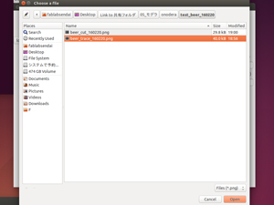

# 02.ソフトウェアセットアップ
  

 
 

ubuntuの左側メニューアイコンから**ターミナル（Terminal）**を開き、**"fab"**と入力してEnterキーを押します。 
そうすると**「Fabmodule」**というソフトが起動します。 
 
 
 

 
 

* **from input format:** image(.png)
* **to output process:** Roland MDX-20 mill(.rml)

上記のように設定したら**「make_png_rml」**ボタンをクリックします。 
 
 
 

 
 

上記のようなウィンドウが表示されます。 
 
 
 

  
 

ウィンドウ左側の**「load.png」**をクリックし、 
加工したいpngデータを選択して**「Open」**ボタンをクリックします。 
 
 
 

 
 

加工したいデータのサイズに間違いがないか確認してください。 
 
 
 

 
 

ウィンドウ上部のプルダウンメニューから**"mill traces(1/64)"**を選択してください。 
 
 
 

 
 

**"offsets"** を **"-1"** に設定し**「make.path」**ボタンをクリックすると、 
実際の加工パス（エンドミルの動くライン）が表示されます。 
 
 
 
 
 
 
