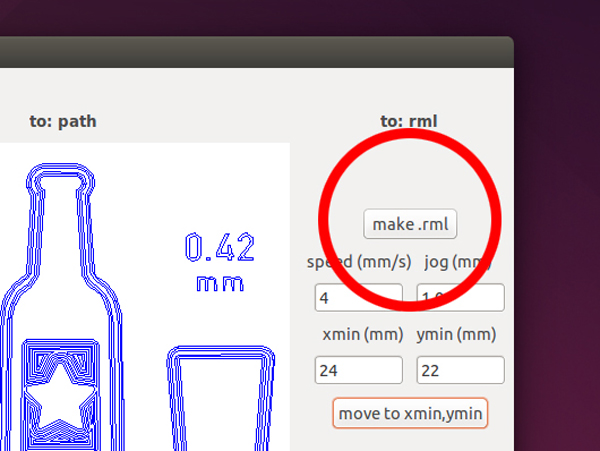
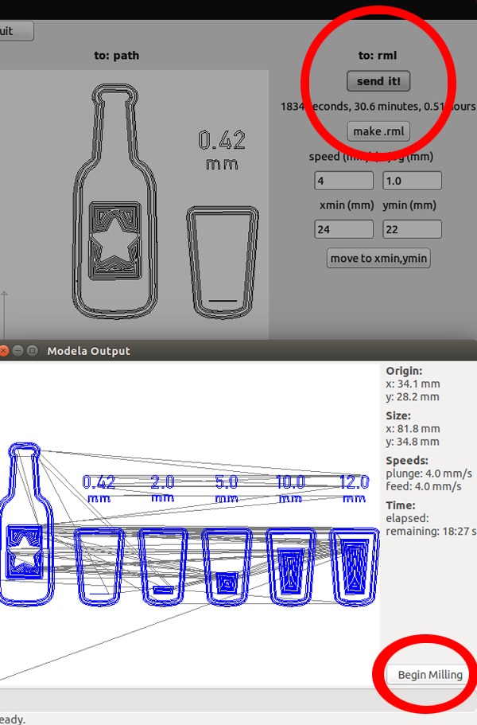
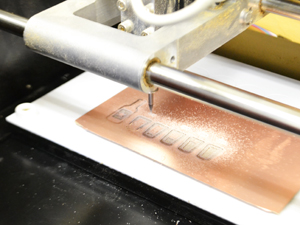
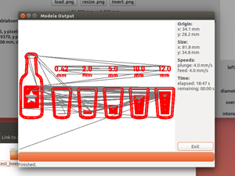
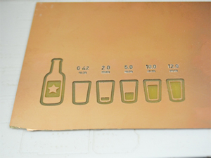

# 04.データ送信〜表面切削加工
  

 
 

speed(mm/s)が **"4"** 、jog(mm)が **"1.0"** に設定されているのを確認したら**「make.rml」**をクリックします。 
 
 
 

 
 

**「send it!」**  をクリックしてマシンへデータを転送し**「Begin Milling」**をクリックして加工を開始します。 
 
 
 

 
 

加工が行われます。 
 
 
 

 
 

加工が完了したら **「Exit」**をクリックます。 
 
 
 

 
 

これで表面切削加工（削り加工）は完了です。 
 
 
 
 
 
 
