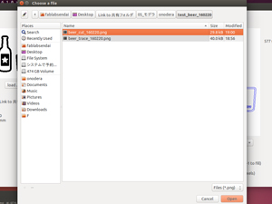
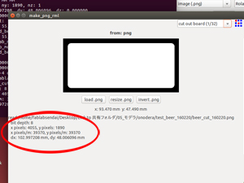
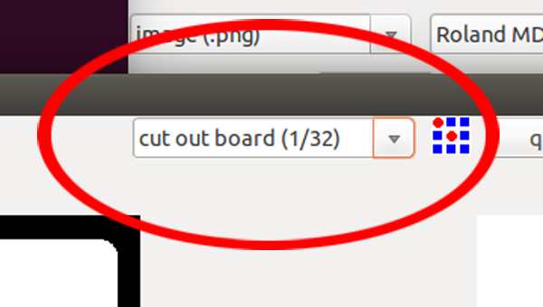
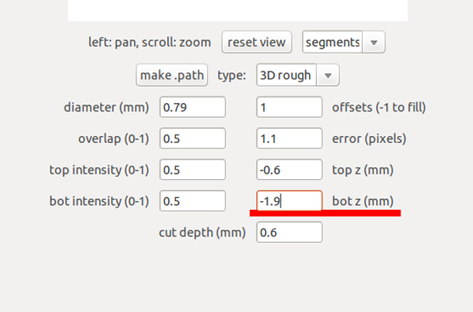
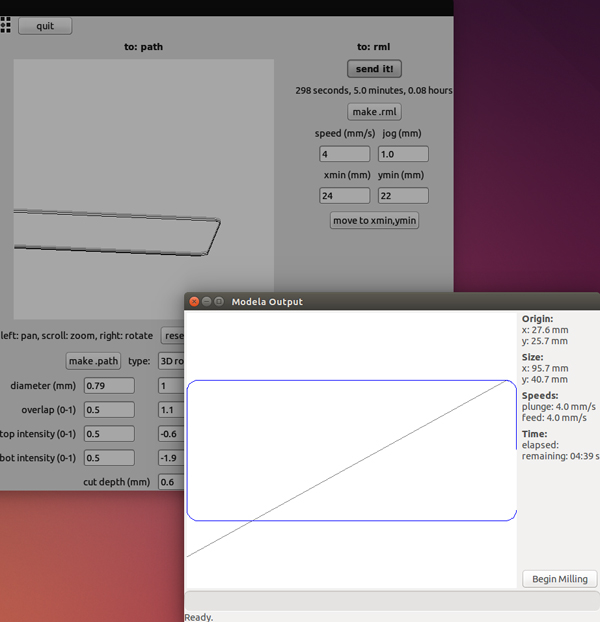
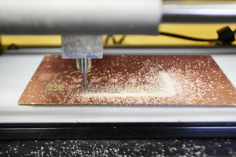
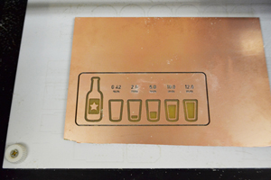
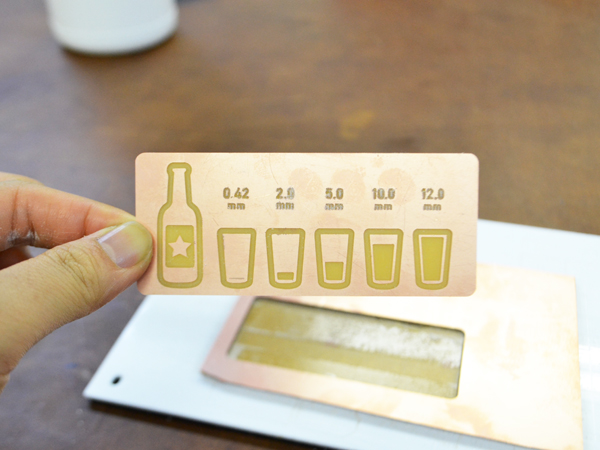

# 05.データ送信〜切断加工
  

  
 

ウィンドウ左側の**「load.png」**をクリックし、 
加工したいpngデータを選択して**「Open」**ボタンをクリックします。 
加工したいデータのサイズに間違いがないか再度確認してください。 
 
 
 

 
 

ウィンドウ上部のプルダウンメニューから**"cut out board(1/32)"**を選択してください。 
更に、[03.マシンのセットアップ](/03-machine-setup.md)の手順を参考にして、 
**直径約0.8mm**（1/32インチ）のエンドミルに取り替えます。 
 
 
 

 
 

**"bot z (mm)"** に、使用する素材の厚さ+0.1mm（実際には削るのでマイナスに変換）を入力します。 
日本で一般的に使用される紙フェノール基板材料の厚さは約1.8mmなので、ここでは**"-1.9"** と入力し 
**「make.path」**ボタンをクリックして実際の加工パス（エンドミルの動くライン）が表示させます。 
（このときに、xmin(mm)とymin(mm)の数値を変更すると原点がズレてしまうので注意！） 
 
 
 

 
 

**「make.rml」** ＞ **「send it!」** ＞ **「Begin Milling」** とクリックし、加工を開始します。 
 
 
 

  
 

加工中にエンドミルが折れてしまうこともあるので、加工を開始したら完全に放置するのではなく 
時々様子を確認するようにしましょう。 
加工が完了したら**「Exit」**ボタンを押します。
 
 
 

 
 

テーブルをマシンから取り外し、ヘラなどを使用して素材を剥がします。 
もし表面にバリなどがある場合は、#800〜#1200などの細かめのやすりで削り落としてください。
 
 
 
 
 
 
